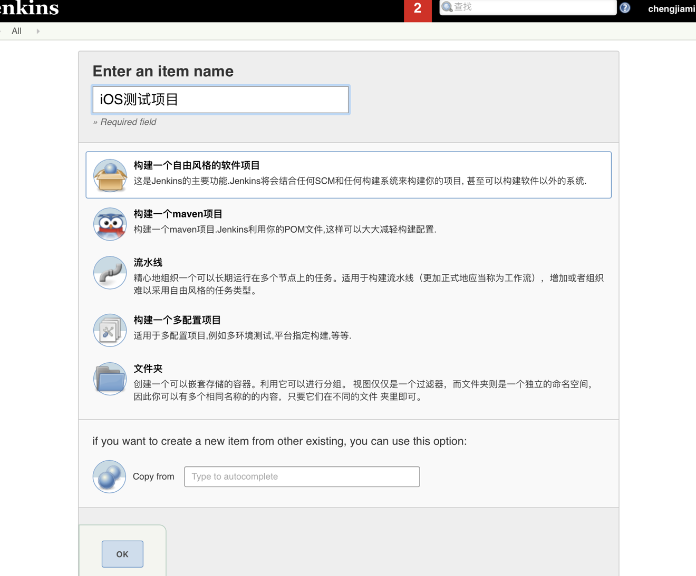
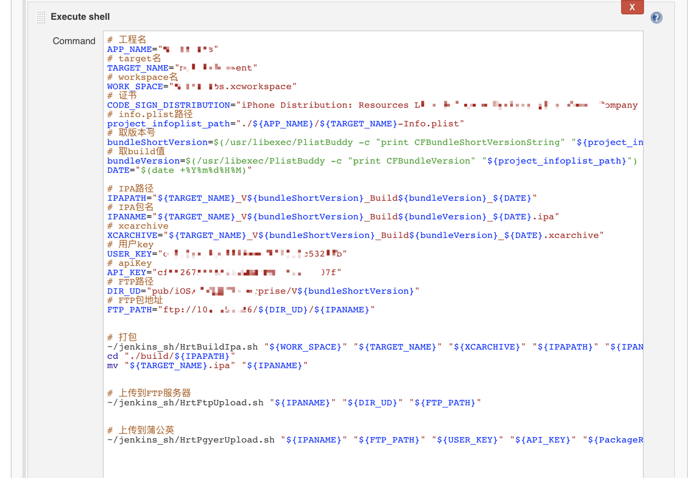
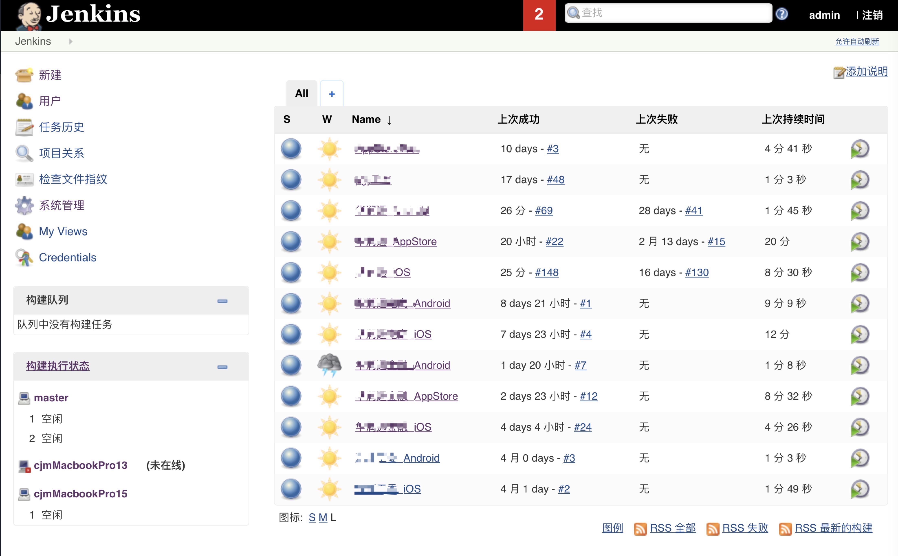

#### 本文将教会你：
- 1、Mac 环境下 Jenkins 的安装配置。
- 2、iOS 自动构建企业包，AppStore 包，安卓项目的自动化构建。
- 3、Jenkins 开机自启动 / 网络开机自动登录认证。
- 4、使用脚本自动上传 iOS/Android 包到 FTP 服务器备份。
- 5、使用脚本自动上传 iOS/Android 包到蒲公英应用管理平台。
- 6、使用脚本将 AppStore 发布包自动上传到 testFlag/AppStore。
- 7、Jenkins 邮件提醒。
- 8、Jenkins 部署 MacOS Slave 实现各自动构建平台的统一，构建机器集群。
> *注：本文的操作环境是 Mac Pro / MacOS 10.13.4 中进行。Jenkins 版本是 2.7.2，Xcode 版本是 9.3，Android Studio 版本是 3.0，Java 版本是 1.8.0_151。下文中所用到的所有 Shell 脚本文件我已上传到 Github：[https://github.com/whihail/AutoArchive]*

#### 安装 Jenkins
在 Mac 环境下，我们需要先安装 JDK，然后在 [Jenkins 的官网](https://jenkins.io) 下载最新的 war 包。下载完成后，打开终端，进入到 war 包所在目录，执行以下命令：
```
java -jar jenkins.war --httpPort=8080
```
待 Jenkins 启动后，在浏览器页面输入以下地址:
```
http://localhost:8080
```
这样就打开 Jenkins 管理页面了。

注意：使用 pkg 包的方式安装将会新建一个 Jenkins 操作系统用户，此用户和普通用户在系统资源和权限方面不一致。将会给后续步骤增加很多麻烦，并可能导致后续步骤失败，所以请确认使用本文介绍方式来安装 Jenkins。

#### 安装 Jenkins 相关插件
点击 +系统管理+->+管理插件+->+可选插件+，可搜索以下插件进行安装
- Git 插件 (GIT plugin)
- Git 参数化构建插件（Git Parameter）
- Gradle 插件 (Gradle plugin) - Android 专用
- Xcode 插件 (Xcode integration) - iOS 专用
- Jenkins 输出日志文字颜色插件（AnsiColor）
- 此插件允许对 Job 设置 Timeout 时间 (Build Timeout)
- 在 Build History 里面显示链接二维码 （description setter plugin）
- SSH 插件 (SSH Credentials Plugin)
- SSH Slaves 插件（SSH Slaves）- 配置 Jenkins Slaves 时需要

#### iOS Job 自动构建设置

新建一个 iOS 的项目来开始自动化构建。点击“新建”，输入 item 名称，选择“构建一个自由风格的软件项目”，然后点击“OK”。




填写项目以及关于项目的描述，然后勾选参数化构建过程（此功能由上述 [Git Parameter](https://wiki.jenkins.io/display/JENKINS/Git+Parameter+Plugin) 插件提供），填写相应描述，Parameter Type 选项支持通过 Branch 构建，Tag 构建， 此处选择 Branch or Tag 构建。


在源码管理项中分别 Repositories 的 git url 地址，Gredentials 此处使用的是 Username with password 方式，也可使用 SSH Username with private key 方式，Branch Specifier 填写 Git Parameter 插件填写的 branch 参数名。

构建触发器指的是触发时机，一般在做持续集成时用到，如每次有新代码提交触发构建、定时间隔触发构建等，此处未使用到，固不做说明。


构建环境中选择 Color ANSI Console Output，ANSI color map 选择 xterm，此配置由[AnsiColor](https://wiki.jenkins.io/display/JENKINS/AnsiColor+Plugin) 插件支持，它可以使 Console Output 支持带颜色的文字输出。

构建中增加构建步骤选择 Execute shell，由于我们项目由多团队开发，使用 CocoaPods 进行集成后构建，所以在构建之前需要 update 各团队的最新代码。

继续增加构建步骤选择 Execute shell，通过获取项目的一些相关信息，进行打包、上传 FTP、蒲公英、TestFlag/AppStore 等操作。




iOS Job 的配置到此结束，保存配置，就可进行构建了，下图是构建成功后的部分 Console Output。以上用到的相关脚本代码将在接下来的文章中做详细说明。


#### Android Job 自动构建设置

Android Job 的配置在构建之前和 iOS 都是一致的，只是构建部分有所区别，此处我们使用上文提到的 [Gradle plugin](https://wiki.jenkins.io/display/JENKINS/Gradle+Plugin) 插件对项目进行构建，添加构建步骤 Invoke Gradle script，选中 Invoke Gradle，Gradle Version 选择 Default，Tasks 填写你需要构建的 Gradle Task。

继续增加构建步骤选择 Execute shell，通过获取项目的一些相关信息（此处 Android 项目相关信息在 version_config Json 文件中获取，在 Gradle Task 中每次对 version_Config 文件进行更改），将 APK 包上传 FTP、蒲公英 等操作。


Android Job 的配置到此结束，保存配置，就可进行构建了，下图是构建成功后的部分 Console Output。以上用到的相关脚本代码将在接下来的文章中做详细说明。


#### 项目展示

下图是公司目前接入 Jenkins 自动构建的一些客户端项目。



[https://github.com/whihail/AutoArchive]:https://github.com/whihail/AutoArchive
